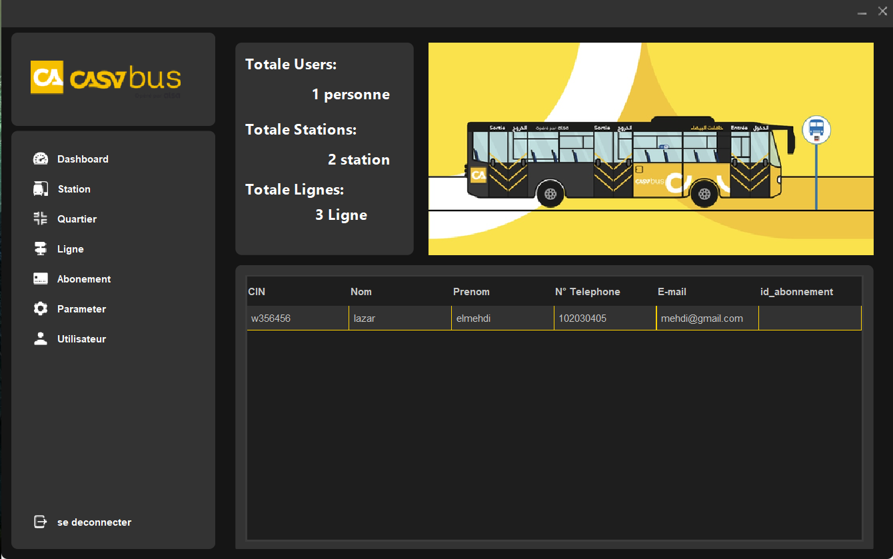
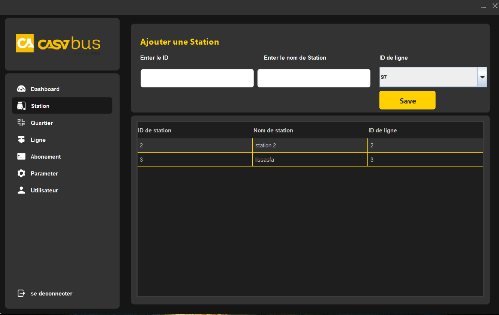
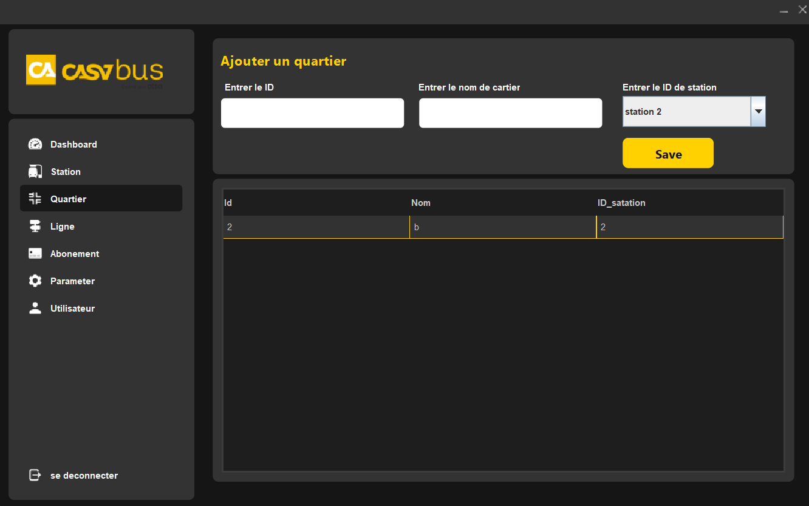

# MedinaBus
Cette application est destinée à aider les entreprises de transport de bus à gérer
efficacement leurs lignes, en offrant une interface utilisateur conviviale pour la gestion
des itinéraires, des horaires et des tarifs

Technologie utilisé: JAVA & Java SWING & MYSQL

# Admin Dashboard

# Gestion des Lignes

# Gestion des Stations

# Gestion des Quartiers

